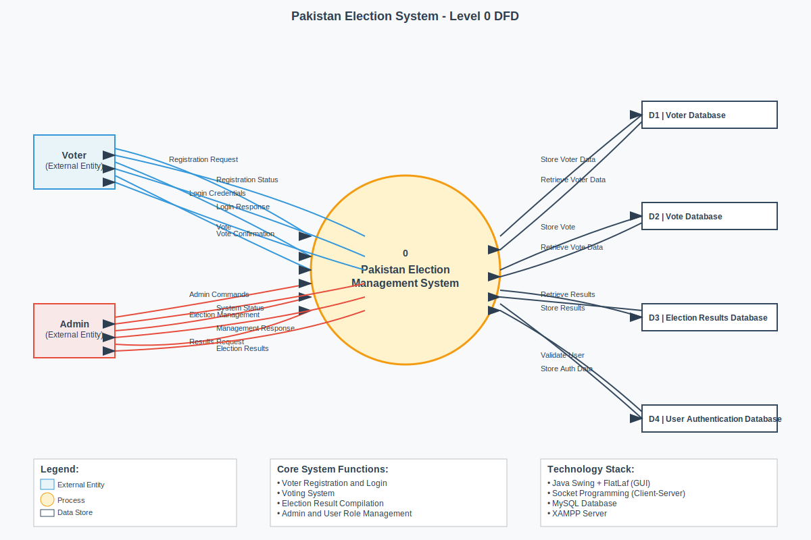
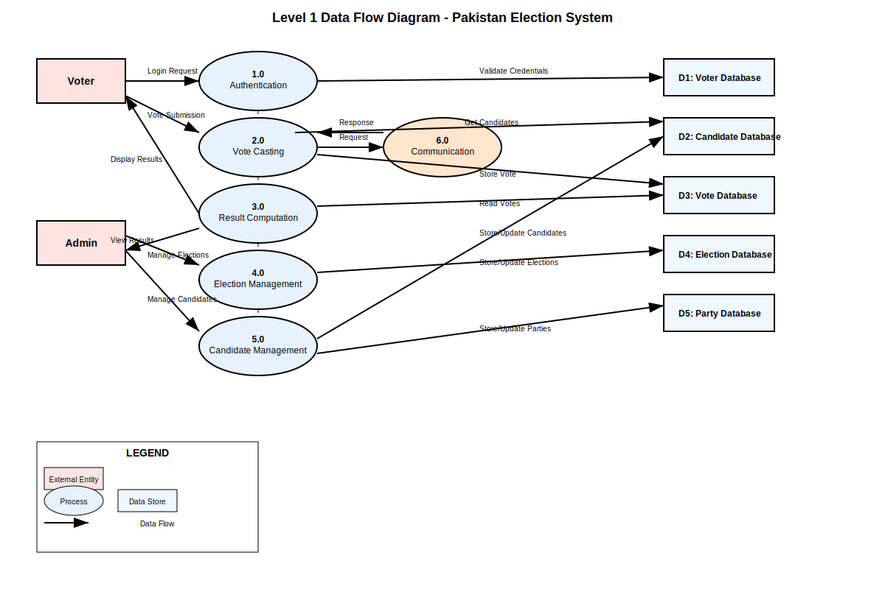
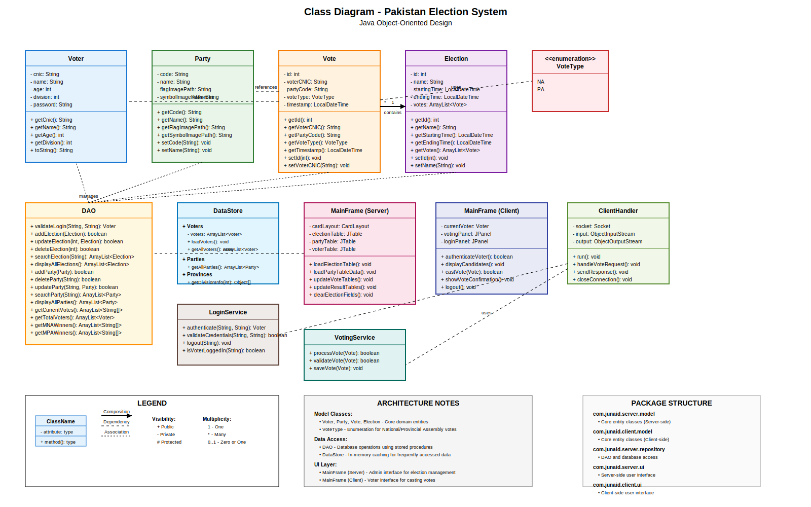
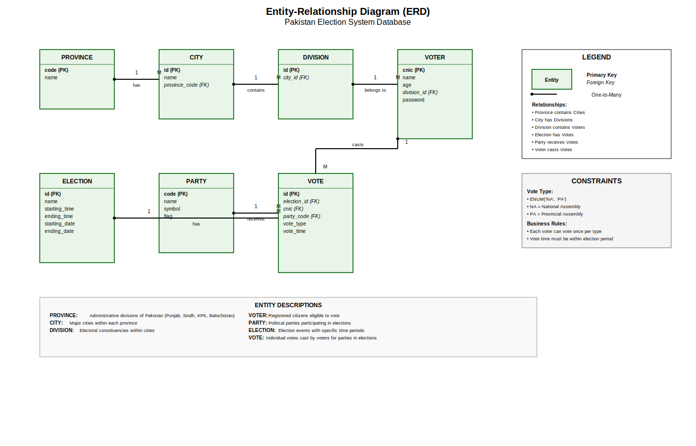

# Software Requirements Specification (SRS)

## Introduction

### 1.1 Motivations
The "Pakistan Election System" aims to digitize and streamline the election process in Pakistan. The motivation behind this project is to ensure transparency, efficiency, and accessibility in elections, reducing manual errors and enhancing voter trust.

### 1.2 Project Overview
This desktop application, built using Java Swing and MySQL, provides a secure platform for managing elections. It includes features such as voter registration, candidate management, secure vote casting, and real-time result computation.

### 1.3 Problem Statement
The traditional election process in Pakistan is prone to inefficiencies, errors, and potential fraud. Manual handling of voter data and results often leads to delays and disputes, undermining the credibility of the election process.

### 1.4 Objectives
- To develop a secure and efficient election management system.
- To ensure transparency and accuracy in vote counting.
- To provide a user-friendly interface for voters, candidates, and administrators.

---

## Domain Analysis

### 2.1 Customer
The primary customers are the Election Commission of Pakistan and other governmental bodies responsible for conducting elections.

### 2.2 Stakeholders
- **Voters**: Individuals eligible to vote.
- **Candidates**: Contestants in the election.
- **Election Officials**: Administrators managing the election process.

### 2.3 Affected Groups
- General public (voters).
- Political parties and candidates.
- Election monitoring organizations.

### 2.4 Dependencies / External Systems
- MySQL database for data storage.
- Java Swing for the user interface.
- External libraries for additional functionalities (e.g., time pickers).

### 2.5 Reference Documents
#### 2.5.1 Related Projects
- Existing election management systems in other countries.
- Open-source election software.

#### 2.5.2 Feature Comparison
- Comparison with manual election processes.
- Comparison with other digital election systems.

---

## Requirements Analysis

### 3.1 Requirements Table
| Type              | Description                                                                 |
|-------------------|-----------------------------------------------------------------------------|
| Functional        | Voter registration, candidate management, vote casting, result computation.|
| Non-Functional    | Security, performance, usability, reliability.                             |
| Data              | Voter data, candidate data, election results.                              |
| Constraints       | Must comply with local election laws.                                      |
| Interface         | Desktop application with a graphical user interface.                      |

### 3.2 List of Actors
- Voter
- Candidate
- Admin

### 3.3 List of Use Cases
- Register as a voter.
- Nominate as a candidate.
- Cast a vote.
- View election results.

### 3.4 System Use Case Diagram
*(Insert Use Case Diagram here)*

### 3.5 Extended Use Cases
#### Use Case: Cast a Vote
- **Actor**: Voter
- **Preconditions**: The voter is registered and authenticated.
- **Steps**:
  1. Log in to the system.
  2. Select the election.
  3. Choose a candidate.
  4. Confirm the vote.
- **Postconditions**: The vote is securely recorded in the database.

### 3.6 User Interfaces
*(Insert mock screens or descriptions of the login screen, voting screen, and result screen)*

---

## Data Flow Diagrams

### 4.1 Level 0 Data Flow Diagram

The Level 0 DFD provides a high-level overview of the Pakistan Election System, showing the system as a single process that interacts with external entities (Voter and Admin) and data stores (Voter Database, Candidate Database, and Vote Database).

### 4.2 Level 1 Data Flow Diagram

The Level 1 DFD decomposes the central Election System into six major subsystems:

1. **Authentication Process (1.0)**: Handles voter login validation by verifying credentials against the voter database and generating authentication tokens.

2. **Vote Casting Process (2.0)**: Manages the core voting functionality, including candidate display, vote selection, validation, and storage.

3. **Result Computation Process (3.0)**: Calculates and processes election results by aggregating votes from the vote database and generating comprehensive result reports.

4. **Election Management Process (4.0)**: Provides administrative functions for setting up elections, managing election parameters, and configuring system settings.

5. **Candidate Management Process (5.0)**: Handles candidate and political party registration, information management, and candidate data maintenance.

6. **Communication Process (6.0)**: Manages client-server socket communication, ensuring secure data transmission between the client application and server components.

**Data Stores:**
- D1: Voter Database - Stores voter registration information and credentials
- D2: Candidate Database - Contains candidate and party information
- D3: Vote Database - Records all cast votes and voting transactions
- D4: Election Database - Maintains election configuration and parameters
- D5: Result Database - Stores computed election results and reports

### 4.3 Level 2 Data Flow Diagram - Vote Casting Process

The Level 2 DFD provides a detailed decomposition of the Vote Casting Process (2.0), breaking it down into six sub-processes:

1. **Candidate Selection (2.1)**: Displays available candidates and their party information to the voter, retrieving data from the candidate database.

2. **Vote Type Selection (2.2)**: Allows voters to choose between National Assembly (NA) and Provincial Assembly (PA) voting options.

3. **Vote Validation (2.3)**: Performs comprehensive validation including voter eligibility checks, duplicate vote prevention, and voting time window verification.

4. **Vote Submission (2.4)**: Handles the network communication for submitting the vote data from client to server using secure socket connections.

5. **Vote Storage (2.5)**: Manages the database operations for storing validated votes in the vote database with proper transaction handling.

6. **Vote Confirmation (2.6)**: Provides feedback to the voter confirming successful vote submission and displays completion messages.

**Additional Components:**
- T1: Vote Session Data - Temporary storage for maintaining vote session information during the voting process
- Error handling flows for managing validation failures and system errors
- Data flows showing the progression from candidate selection through vote confirmation

---

## System Design

### 5.1 Class Diagram

The Class Diagram illustrates the object-oriented design of the Pakistan Election System, showing the main classes, their attributes, methods, and relationships:

**Model Classes:**
- **Voter**: Represents registered voters with CNIC, name, age, division, and password
- **Party**: Political parties with code, name, flag, and symbol images
- **Vote**: Individual votes linking voters to parties with vote type (NA/PA) and timestamp
- **Election**: Election events with timing and associated votes collection
- **VoteType**: Enumeration defining National Assembly (NA) and Provincial Assembly (PA) vote types

**Data Access Layer:**
- **DAO (Data Access Object)**: Handles all database operations using stored procedures
- **DataStore**: Provides in-memory caching for frequently accessed data

**User Interface Layer:**
- **MainFrame (Server)**: Administrative interface for election management
- **MainFrame (Client)**: Voter interface for casting votes

**Service Layer:**
- **LoginService**: Handles voter authentication
- **VotingService**: Manages vote processing and validation
- **ClientHandler**: Manages client-server communication

**Key Relationships:**
- Election contains multiple Votes (1:*)
- Vote references Voter and Party
- DAO manages all model classes
- UI classes use services for business logic

### 5.5 ERD (Entity-Relationship Diagram)

The Entity-Relationship Diagram shows the database schema and relationships between entities:

**Core Entities:**
- **PROVINCE**: Administrative divisions (Punjab, Sindh, KPK, Balochistan)
- **CITY**: Major cities within provinces
- **DIVISION**: Electoral constituencies within cities
- **VOTER**: Registered citizens with CNIC, demographics, and division assignment
- **PARTY**: Political parties with codes, names, symbols, and flags
- **ELECTION**: Election events with start/end dates and times
- **VOTE**: Individual votes linking voters, parties, elections with vote type and timestamp

**Key Relationships:**
- Province → City (1:Many): Each province contains multiple cities
- City → Division (1:Many): Each city has multiple electoral divisions
- Division → Voter (1:Many): Each division contains multiple voters
- Voter → Vote (1:Many): Each voter can cast multiple votes (NA and PA)
- Party → Vote (1:Many): Each party receives multiple votes
- Election → Vote (1:Many): Each election has multiple votes

**Business Rules:**
- Vote type is constrained to 'NA' (National Assembly) or 'PA' (Provincial Assembly)
- Each voter can vote once per vote type per election
- Votes must be cast within the election time period
- Foreign key constraints ensure data integrity

### 5.6 Data Dictionary
**VOTER Table**:
- `cnic` (VARCHAR(13), PK): Unique 13-digit national identity number
- `name` (VARCHAR(50)): Voter's full name
- `age` (INT): Voter's age
- `division_id` (INT, FK): Reference to electoral division
- `password` (VARCHAR(50)): Encrypted authentication password

**PARTY Table**:
- `code` (VARCHAR(5), PK): Unique party identifier (e.g., PTI, PMLN)
- `name` (VARCHAR(100)): Full party name
- `symbol` (TEXT): Path to party symbol image
- `flag` (TEXT): Path to party flag image

**VOTE Table**:
- `id` (INT, PK): Auto-generated unique vote identifier
- `election_id` (INT, FK): Reference to election
- `cnic` (VARCHAR(13), FK): Reference to voter
- `party_code` (VARCHAR(5), FK): Reference to party
- `vote_type` (ENUM): 'NA' for National Assembly, 'PA' for Provincial Assembly
- `vote_time` (TIMESTAMP): When the vote was cast

**ELECTION Table**:
- `id` (INT, PK): Unique election identifier
- `name` (VARCHAR(100)): Election name/description
- `starting_time` (TIME): Daily start time for voting
- `ending_time` (TIME): Daily end time for voting
- `starting_date` (DATE): Election start date
- `ending_date` (DATE): Election end date

**PROVINCE Table**:
- `code` (VARCHAR(5), PK): Province code (PP, PS, KPK, PB)
- `name` (VARCHAR(100)): Full province name

**CITY Table**:
- `id` (INT, PK): Unique city identifier
- `name` (VARCHAR(100)): City name
- `province_code` (VARCHAR(5), FK): Reference to province

**DIVISION Table**:
- `id` (INT, PK): Unique division identifier
- `city_id` (INT, FK): Reference to city

---

## Implementation Details

### 6.1 Development Setup
- **Language**: Java
- **Framework**: Java Swing
- **Database**: MySQL

### 6.2 Deployment Setup
- Desktop application executable.
- MySQL server setup.

### 6.3 Algorithms
- Vote counting algorithm.
- Authentication and authorization logic.

### 6.4 Constraints
- Must operate on Windows and Linux platforms.
- Limited to 10,000 concurrent users.

---

## Conclusion
The "Pakistan Election System" provides a secure, efficient, and transparent platform for managing elections. It addresses the challenges of traditional election processes and ensures voter trust.

---

## Future Work
- Integration with biometric authentication.
- Mobile application for remote voting.
- Support for multiple languages.

---

## Bibliography
- IEEE SRS Standard.
- Election laws and regulations.

---

## Appendix

### 12.1 Glossary of Terms
- **Voter**: An individual eligible to vote.
- **Candidate**: An individual contesting in the election.

### 12.2 Pre-requisites
- Java Runtime Environment (JRE).
- MySQL server.
